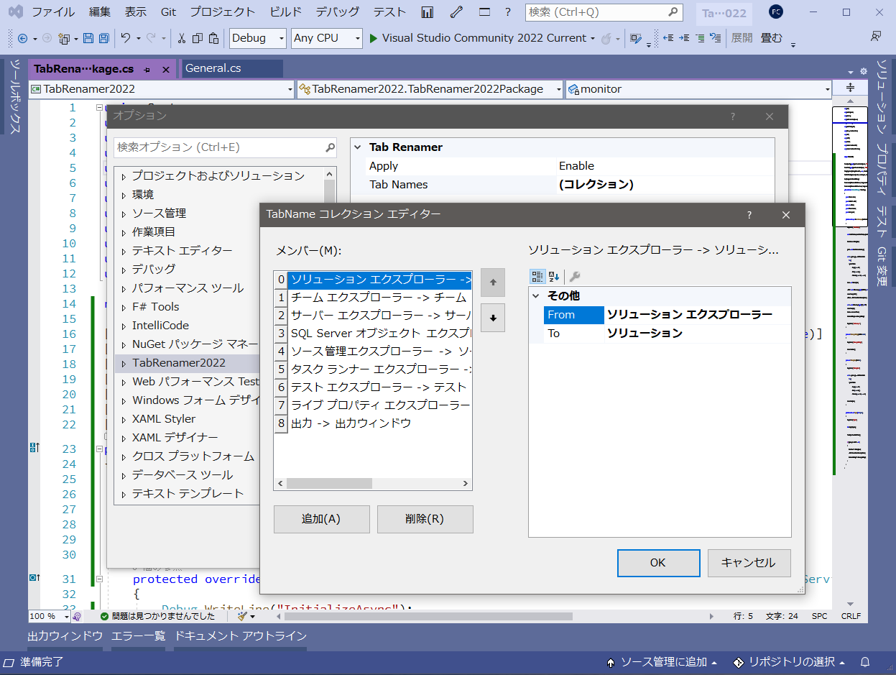

# TabRenamer2022
  

## 概要
Visual Studio 2022用 拡張機能  
ツールウィンドウのタブ名を変更します。
[AutoHideTabRename](https://github.com/TN8001/AutoHideTabRename)のVS2022版です。特に機能追加はありません。

## 特徴
Visual Studio（以下VS）のツールウィンドウ（[ソリューション エクスプローラー]等）を自動的に隠す設定（📌ボタン）にしたり、ウィンドウを複数重ねたりするとタブになります。が、
* 無駄に長い（特にしつこいエクスプローラー推し）
* 出しておきたいタブが多くなり置き場に困ってきた

の点が気になったので、短く（任意の名前に）変更できるようにしました。  

## ダウンロード
一応VSIXを用意しましたが、ソースを確認したうえで各自ビルドを推奨。  
[最新バイナリ](/../../releases/download/v1.0.0/TabRenamer2022.vsix)（Windows10 VS2022 で動作確認）

## 使い方
1. TabRenamer2022.vsixをダブルクリックし、VSにインストールします。
2. VSメニューの[ツール]－[オプション...]－[TabRenamer2022]を開きます。
3. [Tab Names]のコレクションエディタを開きます（右端のボタン）
4. いくつか初期設定が入っていますが、お好みに設定してください。  
 Fromが変更前のタブ名、Toが変更後のタブ名です。（変更前のタブ名は完全一致です。先頭一致や部分一致ではありませんので注意してください）

#### アンインストール
1. TabRenamer2022のオプションで[Apply]を[Disable]にして、元の状態に戻します。
2. VSメニューの[ツール]－[拡張機能と更新プログラム...]からTabRenamer2022を選択し、\[アンインストール]ボタンを押します。

###### インストールフォルダ
フォルダ名は予測不能なので、`TabRenamer2022.dll`で検索してください。  
`C:\Users\[ユーザー名]\AppData\Local\Microsoft\VisualStudio\[VSバージョン]\Extensions\[ランダム文字列]`

## ライセンス
[MIT](LICENSE)

## 注意事項
* 一切責任持ちません。
* ツールウィンドウタイトルを変更しないのは仕様です。
* タブ名が変わらない時は、一度タブを開くと変更されます。
* アンインストール後にタブ名が元に戻らない場合は、お手数ですが下記のリセットをしてください。
* ビルドには下記３つの参照が必要です。
  * `Microsoft.VisualStudio.Platform.WindowManagement.dll`
  * `Microsoft.VisualStudio.Shell.ViewManager.dll`  
  * `Microsoft.Internal.VisualStudio.Interop.dll`
    当方では`C:\Program Files\Microsoft Visual Studio\2022\Community\Common7\IDE\`以下にありました。

###### リセット方法
ほとんどのツールウィンドウは開いた時にタブ名を再設定しますが、一部戻らないものがありました。  
その際はキャッシュの削除で戻ります。（ウィンドウレイアウトもデフォルトに戻ってしまいますが、ご了承ください。）  
`C:\Users\[ユーザー名]\AppData\Roaming\Microsoft\VisualStudio\[VSバージョン]\WindowLayouts\`  
の中のファイルをすべて削除してください。

## 更新履歴
* 2021/11/10 ver1.0.0 初回リリース